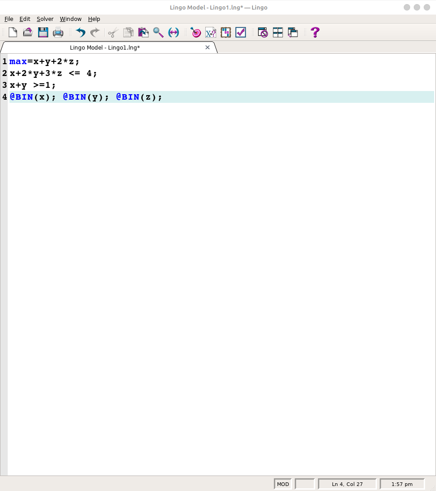
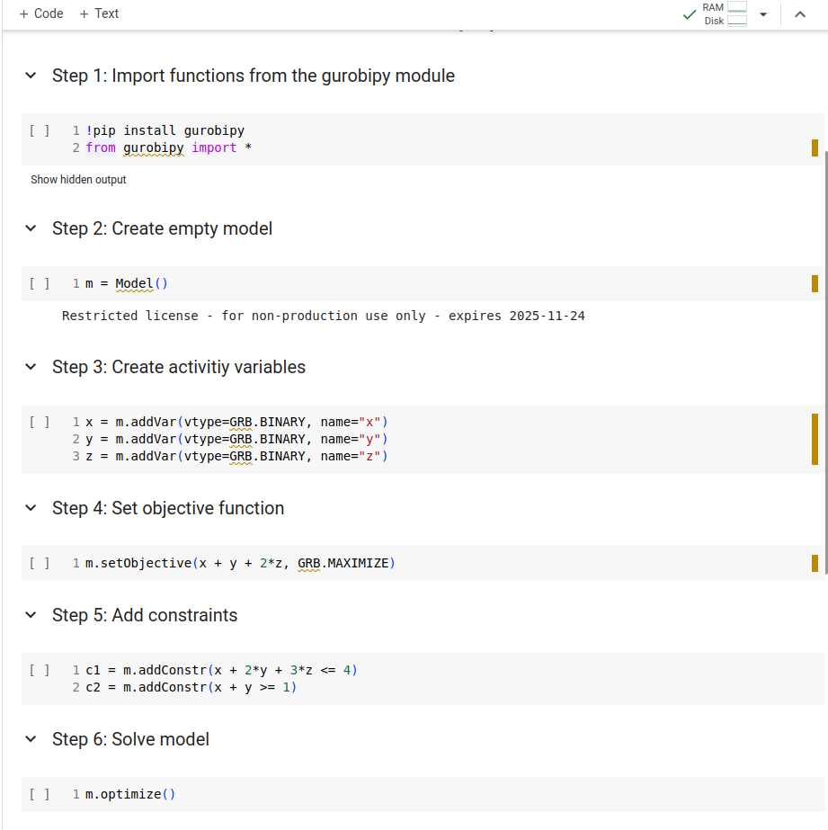

# Using Gurobiby

<!-- This tutorial has  -->
<!-- * Introduction -->
<!-- * Models -->
<!-- * Gurobipy syntax -->
<!-- * Examples -->
<!-- * Advance topics -->
<!-- * Gentle introduction -->
<!-- * Writing small examples -->
<!-- * Using pandas to import data -->
<!-- * Writing large-scale examples -->

Hi everyone, the tutorial of using Gurobi will be held in our lab (744)
at 10 a.m. Dec 21. If you would like to know more about Gurobi, please
feel free to join.

Because writing code requires lots of practices and getting familiar
with new terminologies, if possible, please watch [this
video](https://vimeo.com/830685647/c7f9971fda). The Jupyter notebook can
be run online at [this
link](https://colab.research.google.com/drive/1ZmwcufNbdPBFLo6VZLz6KEioiG128V6I?usp=sharing),
or you can download
[here](https://github.com/JohnTranNTUT/Gurobi_tutorial/blob/89c7fc312ac305bbfb178681f156873be610c285/intro_to_gurobipy.ipynb).

# LINGO vs GUROBI

Because GUROBI is a solver and written in many language (C, C++, Python,
Java, Matlab, R, .NET), we just focus on GUROBI written in Python or
Gurobipy.

## Simple example

Suppose we need to solve an optimization model below:

$$\begin{array}{rll}
 \text{max} & x+y+2z \\
 \text{s.t.} & x + 2y + 3z \le 4 \\
 & x + y \ge 1 \\
 & x,y,z \in \lbrace 0,1 \rbrace
\end{array}
$$

This simple model can be solved by LINGO or GUROBI. The code for LINGO
and GUROBI are shown below:



 The Jupyter notebook can be
found at [this
link](https://colab.research.google.com/drive/1zJ5P9GKLv2wfnBcy5eDmdUX97q8vh9QF?usp=sharing).

At first glance, GUROBI code has more things to type and LINGO code is
very nice and clean for simple models. However, LINGO has its own data
structure which we need to input, LINGO code becomes difficult for
managing input data (parameters) while number of variables and
parameters increases. GUROBI can input data through Python package such
as Pandas which allows to manage data more efficiently.

Moreover, GUROBI solver is faster than LINGO solver (GUROBI is currently
the fastest solver). The documentation and many examples for GUROBI are
also available and you can ask its customer support for help.

<!---->
<!---->
<!---->
<!-- # Introduction -->
<!-- Gurobi is a solver to solve optimization models that is currently the fastest solver in the world and provide free licenses for students. It can solve linear programming (LP), quadratic programming (QP), mixed integer linear programming (MILP), mixed-integer quadratic programming (MIQP), etc. For more information, please visit [here](https://en.wikipedia.org/wiki/Gurobi_Optimizer). -->
<!---->
<!-- To tell computers how to solve optimization problems through Gurobi, we need to use some programming language to instruct computers. One of the popular and easy-to-understand programming language is Python. Python is a programming language that emphasizes code readability. It means we can read and understand code of python more easily. Python has a large library of packages and allow us to manipulate data quickly and efficiently. The downside of python is undesirable performance. Because "Gurobi" solver will convert Python to C and solve in C, the performance of Gurobi solver written in Python may not be affected. -->
<!---->
<!-- # Models -->
<!-- In order to solve optimization efficiently, we need to breaks models into a few parts: -->
<!---->
<!-- * Parameters: are known before solving problems.  -->
<!-- * Variables: values that we need to find -->
<!-- * Objective -->
<!-- * Constraints -->
<!---->
<!-- ## Parameters -->
<!-- Parameters are values known before solving problems. -->
<!---->
<!---->
<!---->
<!-- # Hello World -->
<!---->
<!-- $\alpha$ -->
<!-- $x+y$ -->
<!---->
<!-- This is some python code, in which we define a function `hello`: -->
<!-- ```{python}  -->
<!-- def hello(): -->
<!--   print("Hello") -->
<!-- ``` -->
<!---->
<!---->
<!-- This is how we call it: -->
<!---->
<!-- ```{python}  -->
<!-- hello() -->
<!-- ``` -->
<!---->
<!---->
<!-- We can press `gd` to go to its definition. -->
<!---->
<!-- Let's demonstrate the autocompletion: -->
<!---->
<!-- ```{python}  -->
<!-- import numpy as np -->
<!-- ``` -->
<!---->
<!-- And code hovers with `K`. -->
<!---->
<!-- # Furthermore -->
<!---->
<!-- And then we can work on integrating this for multiple  -->
<!-- languages in the same document, like this R function: -->
<!---->
